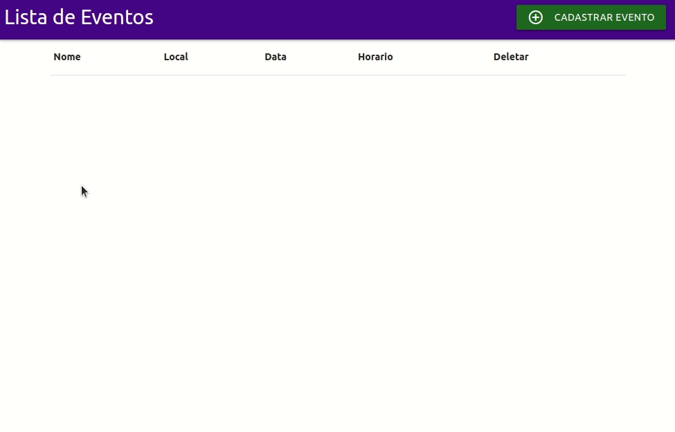

<div align="center">
<p>
    
    <a href="https://twitter.com/Artaxerxes0001">
    • 
    
    </a><br>
    <h1> Eventosapp</h1>
</p>
<h4> 
	🚧  Enventosapp 🚀 Em concluido 🚧
</h4>

<p>
 <a href="#sobre">Sobre</a> •
 <a href="#features">Features</a> •
 <a href="#demonstracao">Demonstração</a> •
 <a href="#pre-requisitos">Pré-Requisitos</a> •
 <a href="#back-end">Rodando o Back End</a> •
 <a href="#front-end">Rodando o Front end</a> •
  <a href="#tecnologias">Tecnologias e Ferramentas</a> •
 <a href="#autor">Autor</a> 

</p>
</div>
<h3><a name="sobre"> Sobre o Projeto </a></h3>
<p align="justify">O eventoapp é uma  agenda eletronica na com armazenamento em nuvem, onde podemos adicionar os nossos eventos e convidados. <br>
Foi desenvolvido com base nos tutorias de Spring Boot do canal da <a href="https://www.youtube.com/watch?v=OHn1jLHGptw&list=PL8iIphQOyG-DHLpEx1TPItqJamy08fs1D"><strong> Michelle Brito  </strong> </a>, nele ela mostra como dar inicio a uma aplicação usando Spring Boot de forma pratica e rapida.
 </p>
 
---

<h3><a name="features"> ✅ Features </a></h3>

- [x] Cadastro do Evento
- [x] Cadastro dos convidados
- [x] Excluir Evento
- [x] Excluir Convidado
---
<h3><a name="demonstracao"> Demonstração </a></h3>



---

<h3><a name="pre-requisitos"> Pré-requisitos </a></h3>
Antes de começar, você vai precisar ter instalado em sua máquina as seguintes ferramentas:

- [Git](https://git-scm.com)
- [Java 11 ou superior](https://openjdk.java.net/)
- [MySQL](https://www.mysql.com)
- [Eclipse IDE](https://www.eclipse.org) ou Qualquer IDE da sua escolha

---
<h3><a name="back-end"> Rodando o Back End </a></h3>


* Clone esse repositorio
```bash
$ git clone https://github.com/artaxerxes001/eventoapp.git
```
* Importa o projeto no Eclipse ou Qualquer IDE da sua escolha

* Baixe as dependencias que normalmente é feito de forma automatica quando estiver conectado a rede

# Execute o projeto clicando no botão de run aplicattion do Eclipse

---
<h3><a name="front-end"> Rodando o Front End </a></h3>

- Com o projeto startado abra o seu navegador e acesse a [url](http:localhost:8080)

---
<h3><a name="tecnologias"> 🛠 Tecnologias </a></h3>

As seguintes ferramentas foram usadas na construção do projeto:
- [Spring Boot](https://spring.io )
- [Thymeleaf](https://www.thymeleaf.org)
- [Materialize](https://materializecss.com)

---

<h3><a name="autor">🦸 Autor</a></h3>

#### Artaxerxes Nazareno


##### Sigam me 
[](https://twitter.com/Artaxerxes0001)  [](https://www.linkedin.com/in/artaxerxes-nazare/) [](mailto:artaxerxesnazare@gmail.com)
